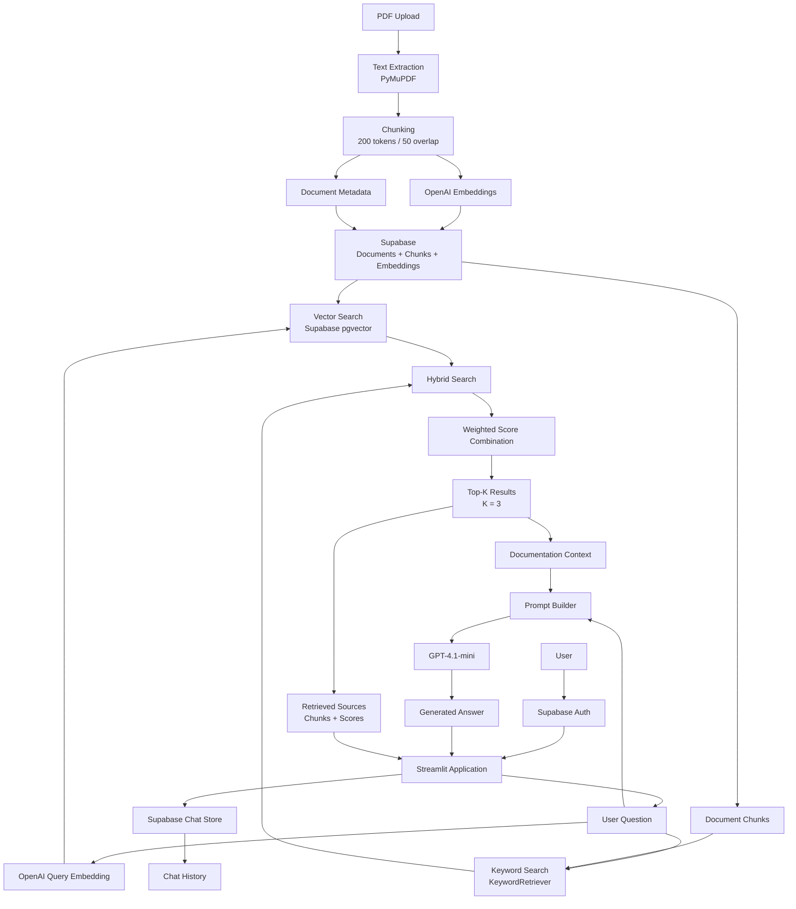

📌 Project Goal

The goal of this project was to build a complete RAG application
rather than a simple LLM chatbot, including document ingestion, embeddings, retrieval,
hybrid search, answer generation, evaluation, authentication, persistent chats, and deployment.


# 🤖 Technical Documentation RAG Assistant

An AI-powered chatbot for asking questions about technical documentation using **Retrieval-Augmented Generation (RAG)**.

The system retrieves relevant document chunks using both **vector search and keyword search**, combines the results with hybrid retrieval, and uses an LLM to generate grounded answers.

## 🚀 Features

- 🔐 User authentication with Supabase
- 📄 PDF document upload and processing
- ✂️ Document chunking
- 🔎 Hybrid retrieval:
  - Vector search
  - Keyword search
  - Weighted score combination
- 🧠 OpenAI GPT-4.1-mini for answer generation
- 💬 Persistent chat history
- 📚 Retrieved source display
- 💰 Token usage and cost tracking
- 🐳 Dockerized application
- ☁️ Deployed Streamlit application

## 🏗️ Architecture


Deployment architecture

                    ┌──────────────────┐
                    │      User        │
                    └────────┬─────────┘
                             │
                             ▼
                    ┌──────────────────┐
                    │   Streamlit App  │
                    │                  │
                    │     Docker       │
                    └───────┬──────────┘
                            │
              ┌─────────────┼─────────────┐
              │             │             │
              ▼             ▼             ▼
       ┌────────────┐ ┌───────────┐ ┌─────────────┐
       │   OpenAI   │ │ Supabase  │ │  Supabase   │
       │    API     │ │ pgvector  │ │    Auth     │
       └────────────┘ └───────────┘ └─────────────┘

          

📊 Retrieval Evaluation

The retrieval system was evaluated on a manually created test dataset.

Method	Hit@3
Vector Search	0.40
Keyword Search	0.70
Hybrid Search	0.90

Hybrid retrieval achieved the best result, improving retrieval performance over both individual methods.

🧪 Evaluation

The project includes separate evaluation scripts for:

Retrieval performance
LLM answer quality
Prompt comparison

The LLM evaluation uses expected answers and an LLM judge to determine whether generated answers are factually correct.

🛠️ Tech Stack

Python · Streamlit · OpenAI API · Supabase · PostgreSQL/pgvector · NumPy · PyMuPDF · Docker

## 📁 Project Structure

```text
rag-ai-chatbot/
│
├── app.py
├── ingest.py
├── main.py
├── prompts.py
├── config.py
├── Dockerfile
├── .dockerignore
├── requirements.txt
├── README.md
│
├── rag/
│   ├── auth.py
│   ├── chat_store.py
│   ├── document_service.py
│   ├── embeddings.py
│   ├── hybrid_search.py
│   ├── keyword_search.py
│   ├── pipeline.py
│   ├── supabase_store.py
│   │
│   └── evaluation/
│       ├── evaluate_llm.py
│       └── evaluate_retrieval.py
│
└── tests/...
```

⚙️ Environment Variables

Create a .env file:

OPENAI_API_KEY=your_openai_api_key


SUPABASE_URL=your_supabase_url
SUPABASE_ANON_KEY=your_supabase_anon_key
SUPABASE_SERVICE_ROLE_KEY=your_service_role_key


▶️ Run Locally
pip install -r requirements.txt
streamlit run app.py
🐳 Docker

Build the image:

docker build -t rag-ai-chatbot .

Run:

docker run -p 8501:8501 --env-file .env rag-ai-chatbot

Then open:

http://localhost:8501

Video of the app:

https://youtu.be/E2k-nHFi0_A?is=NfaiOnws28v2Lkj6


        
